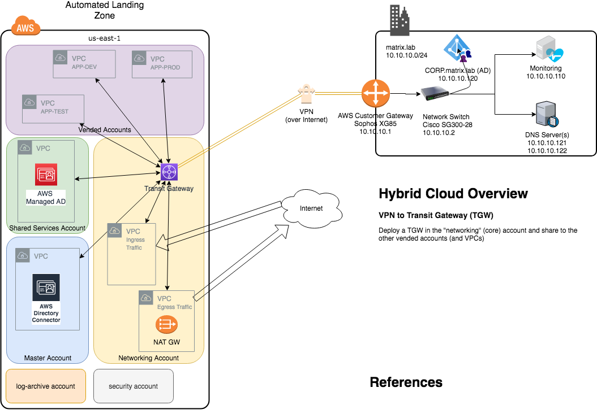
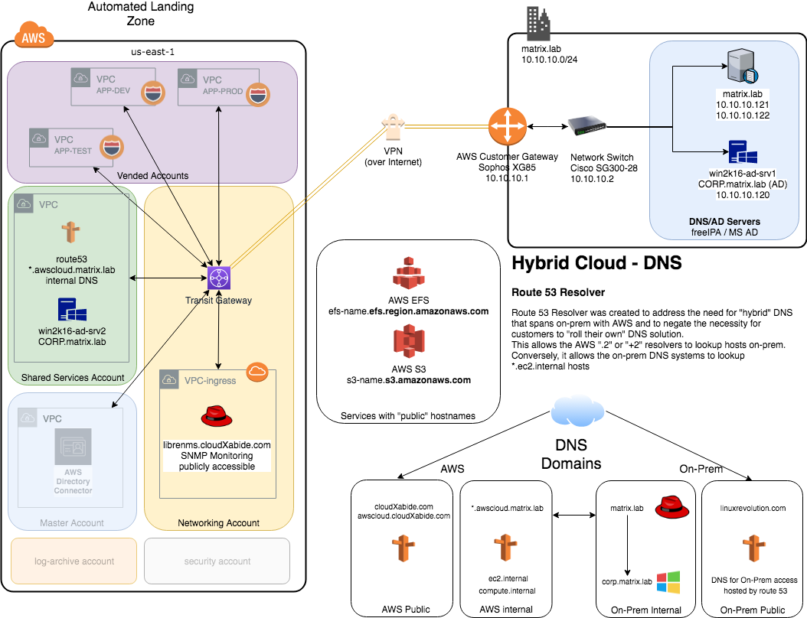

# matrix.lab
Matrix.lab is my home Lab used for testing Hybrid Cloud consisting of my "Red Hat" on-premesis environment and my AWS environment build using Automated Landing Zone (ALZ).

Version: 2019-05-10

## Overview
This repo will detail step-by-step tasks to deploy my Hybrid Cloud.  Some steps have dependencies of earlier tasks and therefore some must be done in order.

### The Environments
* AWS Environment 
  * multi-account (I will deploy Automated Landing Zone (ALZ) in AWS for this test)
  * multi-VPC 
  * Transit Gateway
  * Site-to-Site VPN
  * Several EC2 instances (to test connectivity)
  * route 53 resolver (hybrid DNS, conditional forwarding, in the Shared Services VPC)
  * Vended Accounts:  cxa-dev, cxa-prod, cxa-test

* Homelab Environment
  * Sophos XG85
  * Cisco SG300-28 Managed Switch
  * CentOS 7.6 (at the time of writing this)
  * [OpenShift Container Distribution - okd](https://okd.io) (Essentially the community version of Red Hat OpenShift)
  * [libreNMS](https://www.librenms.org/) 
  * oVirt (Community version Red Hat Virtualization)
  * fairly standard Commodity Off The Shelf (COTS) hardware (Intel NUCs, Asus builds, HPe ML-30s)  

## Layout
### Automated Landing Zone - Overview
  
### Hybrid DNS - Overview

### Federated Login

## Implementation - The Steps
- [Prerequisites](prerequisites.md)
- [Deploy Automated Landing Zone](automated_landing_zone.md)  
  - [add networking (core) account](update_alz_add_networking.md)
- [Configure Hybrid Connectivity](hybrid_connectivity.md)
  - using VPN to TGW  
  - Sophos XG85 Firewall  
- [Share Transit Gateway to existing Accounts](resource_share-TGW.md)  
- [Configure route53 resolver](route53resolver.md)
- [install libreNMS](install_libreNMS.md)

## NOTES
This is not (necessarilly) easy, but it *is* straight-forward.  
This repo does NOT provide an in-depth review of the core functionality/services that are being utilized.  (i.e. you have to know why an Internet Gateway is used in some cases, and a NAT Gateway, in others - if you really want to know what is going on here).  
That said: I am assuming you know how to deploy an EC2 instance and have created SSH keys in the regions you plan to use.  
