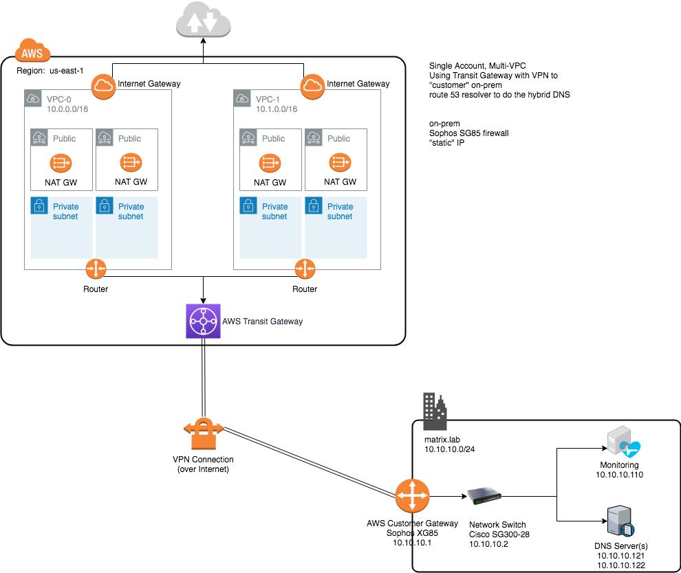

# matrix.lab
My Home Lab used for testing Hybrid Cloud  
Version: 2019-05-10

## Overview
This repo chronicles the deployment of a Hybrid Cloud consisting of AWS and an on-premises Open Source cloud (based on community Red Hat bits)  
### The Environments
* AWS Environment 
  * single-account 
  * multi-VPC 
  * Transit Gateway
  * Site-to-Site VPN
  * 2 x Public Subnets (per VPC)
  * 2 x Private Subnets (per VPC)
  * Several EC2 instances (to test connectivity)
  * route 53 resolver (hybrid DNS, conditional forwarding)

* Homelab Environment
  * Sophos XG85
  * Cisco SG300-28 Managed Switch
  * CentOS 7.6 (at the time of writing this)
  * oVirt (Community version Red Hat Virtualization)
  * okd (Essentially the community version of Red Hat OpenShift)
  * [libreNMS](https://www.librenms.org/) 
  * fairly standard Commidity Off The Shelf (COTS) hardware

## Layout

## Implementation - The Steps
You should be able to follow the following implementation guide and have an operational "hybrid cloud" setup once done.  
[implementation.md](implementation.md)

## NOTES
This is not easy, but it *is* straight-forward.  
This repo does NOT provide an in-depth review of the core functionality/services that are being utilized.  (i.e. you have to know why an Internet Gateway is used in some cases, and a NAT Gateway, in others - if you really want to know what is going on here)..
