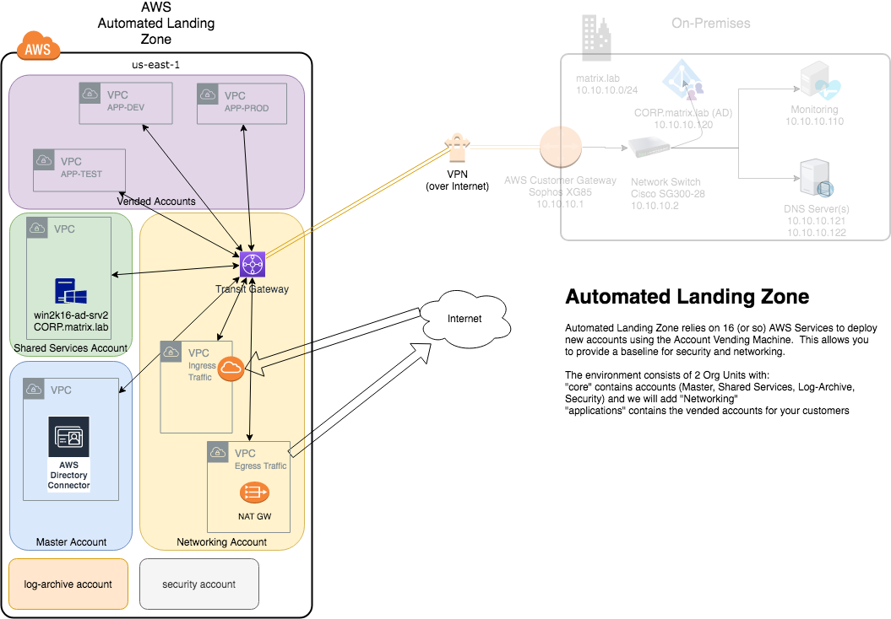

# Welcome to matrix.lab
matrix.lab is my home Lab used for testing Hybrid Cloud consisting of my "Red Hat" on-premises environment and my AWS environment.  I utilize Automated Landing Zone (ALZ) to deploy my AWS resources (similar to what customers are doing).

Version: 2019-05-10

## Overview
This repo will detail step-by-step tasks to deploy my Hybrid Cloud.  Some steps have dependencies of earlier tasks and therefore some must be done in order.

Hybrid cloud is a fairly nebulous term.  It may mean:  
* running in separate environments, but the workload is not distributed other than some shared resources (AD, for example)
* running in separate environments, and the workload may run in either environment (i.e. myapp.company.com may run in the cloud, or on-prem)
* running in multiple public clouds (though... this is usually identified by another debatable term "multi-cloud"
* Or...

I  try not get *too* hung up on what specifically the term means and (rather) focus on what the customer needs in order to get as much value from their IT spend.  Solutions rather than buzzwords.  

Challenge facing many orgainizations:
* technical debt (they own or have lease contracts for:  facilities, cooling, network, compute, etc...)  
* refactoring their old code may be cost-prohibitive  
* they need additional training/resources before they are ready for the cloud

### The Environments
* AWS Environment 
  * multi-account (I will deploy Automated Landing Zone (ALZ) in AWS for this test)
  * multi-VPC 
  * Transit Gateway
  * Site-to-Site VPN
  * Several EC2 instances (to test connectivity)
  * route 53 resolver (hybrid DNS, conditional forwarding, in the Shared Services VPC)
  * Vended Accounts:  cxa-dev, cxa-prod, cxa-test

* Homelab Environment
  * Sophos XG85
  * Cisco SG300-28 Managed Switch
  * CentOS 7.6 (at the time of writing this), RHEL 8 (where possible)
  * [OpenShift Container Distribution - okd](https://okd.io) (Essentially the community version of Red Hat OpenShift)
  * [libreNMS](https://www.librenms.org/) 
  * oVirt (Community version Red Hat Virtualization)
  * fairly standard Commodity Off The Shelf (COTS) hardware (Intel NUCs, Asus builds, HPe ML-30s)  

## Layout
### Hybrid Cloud Overview
  
### Automated Landing Zone - Overview
  
### Hybrid DNS - Overview

### On-premises Infrastructure

### Federated Login

## Implementation - The Steps
- [Prerequisites](prerequisites.md)
- [Deploy Automated Landing Zone](automated_landing_zone.md)  
  - [add networking (core) account](update_alz_add_networking.md)
- [Configure Hybrid Connectivity](hybrid_connectivity.md)
  - using VPN to TGW  
  - Sophos XG85 Firewall  
- [Share Transit Gateway to existing Accounts](resource_share-TGW.md)  
- [Configure route53 resolver](route53resolver.md)
- [install libreNMS](install_libreNMS.md)

## NOTES
This is not (necessarilly) easy, but it *is* straight-forward.  
This repo does NOT provide an in-depth review of the core functionality/services that are being utilized.  (i.e. you have to know why an Internet Gateway is used in some cases, and a NAT Gateway, in others - if you really want to know what is going on here).  
That said: I am assuming you know how to deploy an EC2 instance and have created SSH keys in the regions you plan to use.  
