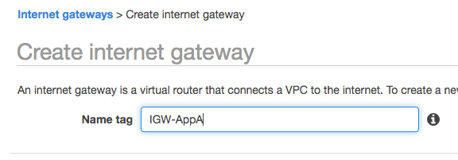

# implementation.md

## AWS 
See below for links to the references to see what my Toplogy is and what my subnets (CIDR) looks like.  

* Login to your AWS console  
  Browse to https://\<Account Id:\>.signin.aws.amazon.com/console  
  NOTE:  I usually do my demo work in us-east-1 (N. Virgina)  
  
* Create 2 x VPCs   
  Click Services and in text box "Find a service..." type "VPC" and select VPC  
  Create VPC-AppA  
    
  Create VPC-AppA  
    
* Create 4 subnets in each VPC (we will make 2 x public after they are created)  
  Click on Subnets in the left-hand panel and click Create Subnet  
  reference [network_overview.md](network_overview.md) for IP/subnet info  
  NOTE:  I manually distribute my Subnets to different AZs to allow for an Network Load Balancer (NLB) later  
  For the 2 x public Subnets, click the subnet and click Actions | Modify auto-assign IP settings.  Then click the check box for "Enable auto-assign public IPv4 address"  
  
* Create and Attach IGW to each VPC
  Click on Internet Gateways in the left-hand pane and click "Create Internet gateway"  
  Once you have created both IGWs, select each one at a time and click "Actions | Attach to VPC" and then attach them to the appropriate VPC  
    
* Create Route Tables and associate with Public Subnets
  Click on Route Tables in the left-hand pane and click Create route table.
  Once you have created the route tables, click on each and select "Routes" in the lower half of the window.  Click "Edit routes"
  Click "Add route", Destination: 0.0.0.0/0, Target: (select Internet Gateway and chose the available IGW), click Save routes
  Then click "Subnet Assocations" in the lower half and "Edit subnet associations".  Select your 2 x public subnets and click Save  
    
  
  
     

* Create Security Group for the "public hosts"
  Click on "Security Groups" in the left-hand pane and click "Create security group" 
  Once they are created, select each one and click "Inbound Rules" towards the bottom half.  Click Edit Rules and Add Rule.
  Type: SSH, Source: Anywhere (you likely don't want this in production.
* Create Security Group for the "private hosts"
  Click on "Security Groups" in the left-hand pane and click "Create security group" 
  Once they are created, select each one and click "Inbound Rules" towards the bottom half.  Click Edit Rules and Add Rule.
  Type: SSH, Source: 10.0.0.0/8 
  (SELFNOTE:  Probably want to add ICMP?)
* Create NAT Gateways (NGW)
  Click on "NAT Gateways" and "Create NAT Gateway".  Now - this is (possibly) counter-intuitive, but select your "public subnets".
  Select a public subnet and click "Create New EIP" then "Create a NAT Gateway"
  You should wait for a few minutes, but eventually you will see you have a Elastic IP Address, Private IP Address.
* Create an EC2 instance in each subnet
  be sure to select the correct Subnets and Security Groups
  I will typically provide a name in the EC2 Instances summary screen as soon as I create the instance (like: EC2-AppA-Pub-10.0.0.0
  ) otherwise, things can get confusing.  (IP Address should provide a good hint where the instance is though)

* BREAK...
Login to one of your Public EC2 instances... see if you can ssh to your other Public EC2 instance (first in the same VPC, then the other VPC).
Then see if you can ssh to your Private EC2 instance in the same VPC, then the other VPC.  At this point, you will NOT be able to connect from one VPC to the other.

* Create a Transit Gateway
 Click on Transit Gateways and "Create Transit Gateway" - provide a Name tag and Description.
 I have been selecting "Auto accept shared attachments"
 Wait for it to change state
* Create Transit Gateway Attachments for each VPC
  Click on Transit Gateway Attachments and "Create Transit Gateway Attachment".
  Select the only Transit Gateway ID* that should be available
  Attachment type: VPC
  Provide an Attachment name tag and then select a VPC.  Leave ALL the subnets selected and click "Create attachment"
* Create Transit Gateway Attachments for the VPN 
  Click on Transit Gateway Attachments and "Create Transit Gateway Attachment".
  Select the only Transit Gateway ID* that should be available
  Attachment type: VPN
  Customer Gateway: New 
  IP Address: (public IP of your VPN endpoint (Customer Gateway)
  I have selected "static" for Routing Options (need to double-check that this is optimal, even if it works this way)
  Click "Create attachment" and wait for it to change state to "available" (probably 5 minutes?) - I use this time to "name" my attachment.
  NOTE:  This step will create a "Site-to-Site VPN Connection" as well as a "Customer Gateway"
* Download the VPN Configuration
  Click on "Site-to-Site VPN Connections" and select your VPN connection.
  Click on "Download Configuration" and seelct Vendor: Generic, Platform: Generic, Software: Vendor Agnostic and save the txt file.

* Go do the Sophos stuff....

* Update Transit Gateway Route Tables to include on-prem
  Click on "Transit Gateway Route Tables" and select your tgw
  Click on Routes towards the bottom and click "Create Route"
  Enter your CIDR and select your VPN TGW Attachment
* Update your Public/Private Route Tables
  Click on each Route Table and "Edit Routes" and "Add Route" enter your on-prem CIDR and for the target, select your TGW and click "Save Routes"

## On-premises Setup (Sophos)

## Testing

## Route 53 Resolver (Hybrid DNS)
* Create Security Group allowing DNS queries (TCP/UDP) from 10.0.0.0/8 in VPC-AppA and VPC-AppB

## Markdown examples

> **_NOTE:_**  Here is a blockquote

    **_NOTE:_**  Here is a "double tab"

## References
[network_overview.md](network_overview.md)  
[inventory.md](inventory.md)  

