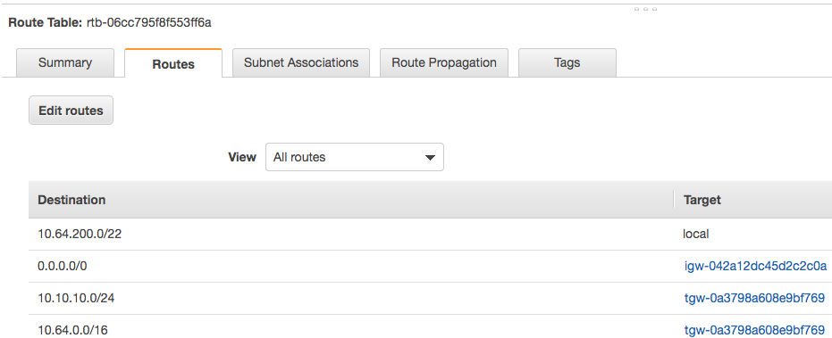
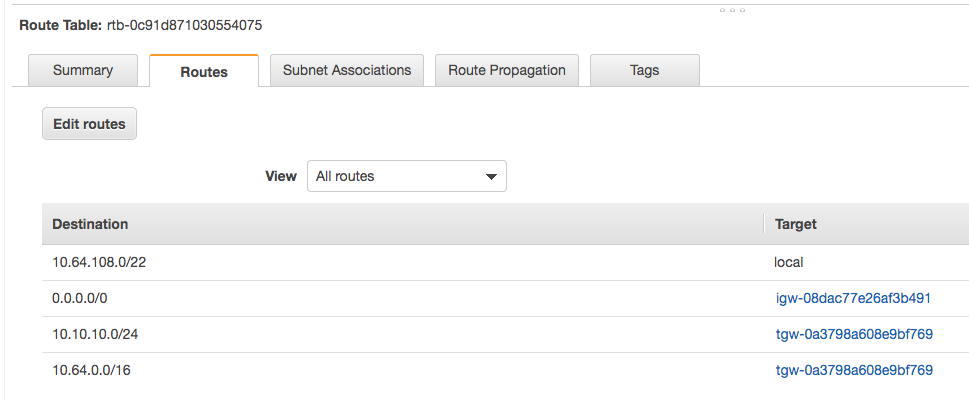

# Vend Account from AVM (Account Vending Machine)

## Vend Account
Go to Service Catalog | Products List (top-left pane)  
Click on the vert ellipses for "AWS-Landing-Zone-Account-Vending-Machine" and "Launch Product"  
Vend the account.  (For demo purposes, Select an AZ configuration with public AZs)  
In your CloudFormation console, you will see the new account being vended.  Under "Outputs" gather the Account Number.  

### Spin up EC2 instance in a public subnet
Once your EC2 instance is up and running, connect to it and then attempt to connect to resources in another account (VPC) - it should/will fail.

Ping test:  10.64.200.198 is a long-running host in the "networking account"
```
[ec2-user@ip-10-64-108-243 ~]$ ping -c 1 10.64.200.198; nslookup co7-ipa-srv01.matrix.lab
PING 10.64.200.198 (10.64.200.198) 56(84) bytes of data.

--- 10.64.200.198 ping statistics ---
1 packets transmitted, 0 received, 100% packet loss, time 0ms

Server:        10.64.108.2
Address:    10.64.108.2#53

** server can't find co7-ipa-srv01.matrix.lab: NXDOMAIN
```

## Share Transit Gateway
Switch to your Networking Account  
Browse to the "Resource Access Manager" console.  
 - NOTE: At this point, you should already have a share for the Transit Gateway (if you do not, follow the process in [README.md](./README.md))  
Click on the TGW Share and then "Modify" (upper right-hand corner)  
Under "Principals", add the AWS Account Number for your newly vended account and click "Save Changes".

## Accept Transit Gateway Share
Login to the AWS console for your "App account"
Browse to "Resource Access Manaager"
 - NOTE:  this is a bit clunky at-first - since this account has not accessed "RAM" before, it brings up the splash-screen (AKA "Getting Started" page).
Click the 3 hamburgers on towards the left border 
  Shared with me | Resource shares (1 invitation)
Click on the TGW share name, then click "Accept resource share"

### Create TGW Attachment
Browse to VPC and look for "Transit Gateway Attachments" at the bottom left-hand pane.
Click on "Create Transit Gateway Attachment"
Select the TGW under "Transit Gateway ID*" (type will be preselected)
Provide an Attachment name tag ("ATT-TGW-App03")
Select the available VPC and subnets   
NOTE:  The attachment may take a few minutes to change state

### Create Route in Route Table(s)
You will need to wait for the TGW Attachment to complete before proceeding
Click on Route Tables (left-hand pane) and select each of the existing Route Tables, then Routes
Add 10.64.0.0/16 and make the Target your TGW

  
  

DISCLAIMER - this... is a bummer.  If the subnet you are about to attach to is NOT within the original VPC CIDR  
VPCcidr (ALZ):  10.64.0.0/16  
VPCcidr (App03):  10.108.0.0/22
you need to ALSO update the Route Table(s) for the VPCs you want to be able to communicate with.  THEREFORE, it is very important that you architect your network space correctly up-front.

```
[ec2-user@ip-10-64-108-243 ~]$ ping -c 1 10.64.200.198; nslookup co7-ipa-srv01.matrix.lab
PING 10.64.200.198 (10.64.200.198) 56(84) bytes of data.
64 bytes from 10.64.200.198: icmp_seq=1 ttl=63 time=2.43 ms

--- 10.64.200.198 ping statistics ---
1 packets transmitted, 1 received, 0% packet loss, time 0ms
rtt min/avg/max/mdev = 2.430/2.430/2.430/0.000 ms
Server:        10.64.108.2
Address:    10.64.108.2#53

** server can't find co7-ipa-srv01.matrix.lab: NXDOMAIN
```

### Share Route 53 Resolver Rule
Login to the console which has your route 53 resolver rules for your on-prem domains and browse Services for Resource Access Manager.
Create a Resource Share
Provide a Name and select Resolver Rules under Resources - optional | Select resource type
Under Principals, add your Vended Account Number
Login in to the console for your Vended Account and Browse to Resource Access Manager | Shared with me | Resource Shares
Click the Resolver Share and "Accept Resource Share", then OK
You then need to browse to Route 53 | Rules | (the shared Resolver Rule)
Click Associate VPC and select your VPC

And now... everything is working for AWS VPCs and on-prem Subnet(s)
```
[ec2-user@ip-10-64-108-243 ~]$ ping -c 1 10.64.200.198; ping -c 1 10.10.10.121; nslookup co7-ipa-srv01.matrix.lab
PING 10.64.200.198 (10.64.200.198) 56(84) bytes of data.
64 bytes from 10.64.200.198: icmp_seq=1 ttl=63 time=2.22 ms

--- 10.64.200.198 ping statistics ---
1 packets transmitted, 1 received, 0% packet loss, time 0ms
rtt min/avg/max/mdev = 2.222/2.222/2.222/0.000 ms
PING 10.10.10.121 (10.10.10.121) 56(84) bytes of data.
64 bytes from 10.10.10.121: icmp_seq=1 ttl=62 time=46.3 ms

--- 10.10.10.121 ping statistics ---
1 packets transmitted, 1 received, 0% packet loss, time 0ms
rtt min/avg/max/mdev = 46.325/46.325/46.325/0.000 ms
Server:        10.64.108.2
Address:    10.64.108.2#53

Non-authoritative answer:
Name:    co7-ipa-srv01.matrix.lab
Address: 10.10.10.121
```


